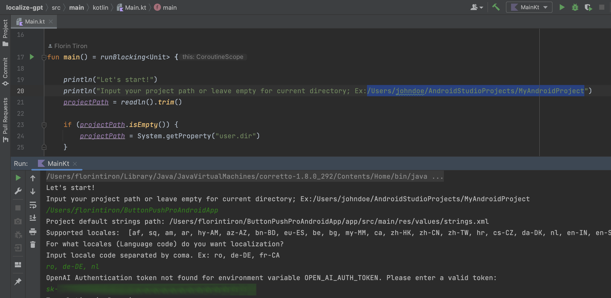
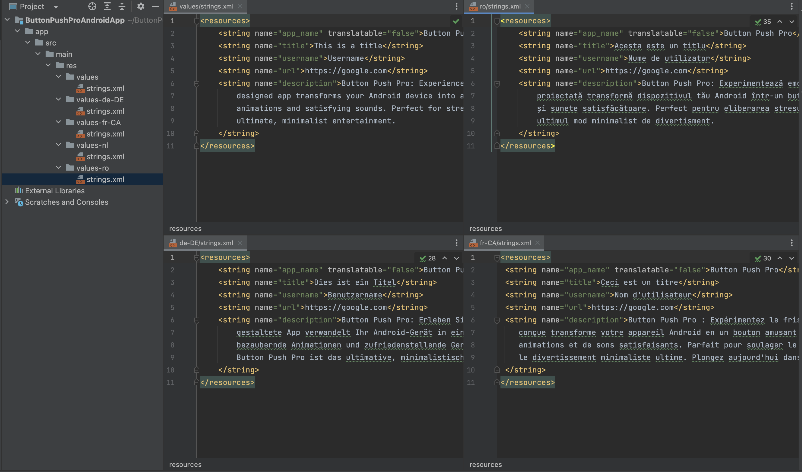

# Localize GPT

Kotlin script that helps with translation of localized strings for Android Apps, using ChatGPT from OpenAI.

## Setup

#### OpenAI API Key

Create an account on https://platform.openai.com/ and generate an API Key from https://platform.openai.com/account/api-keys.

Optional: Setup the key as enviromental variable under ```OPEN_AI_AUTH_TOKEN```

## Running the Script

* Clone the project

```bash
  git clone https://github.com/florin-tiron/localize-gpt.git
```

* Open with Android Studio or IntelliJ IDE

* Easy run via IDE

* Input required data

* Check result
